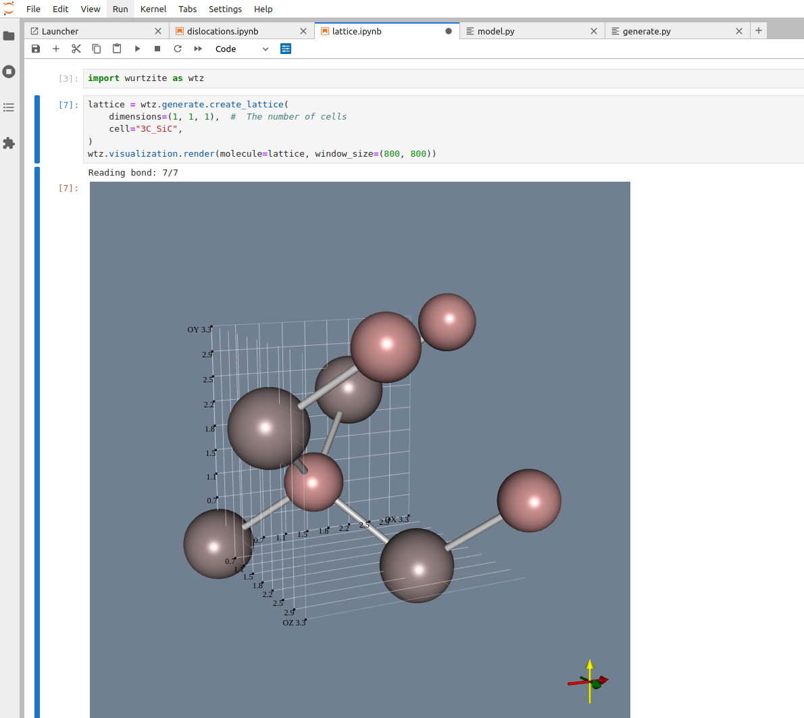
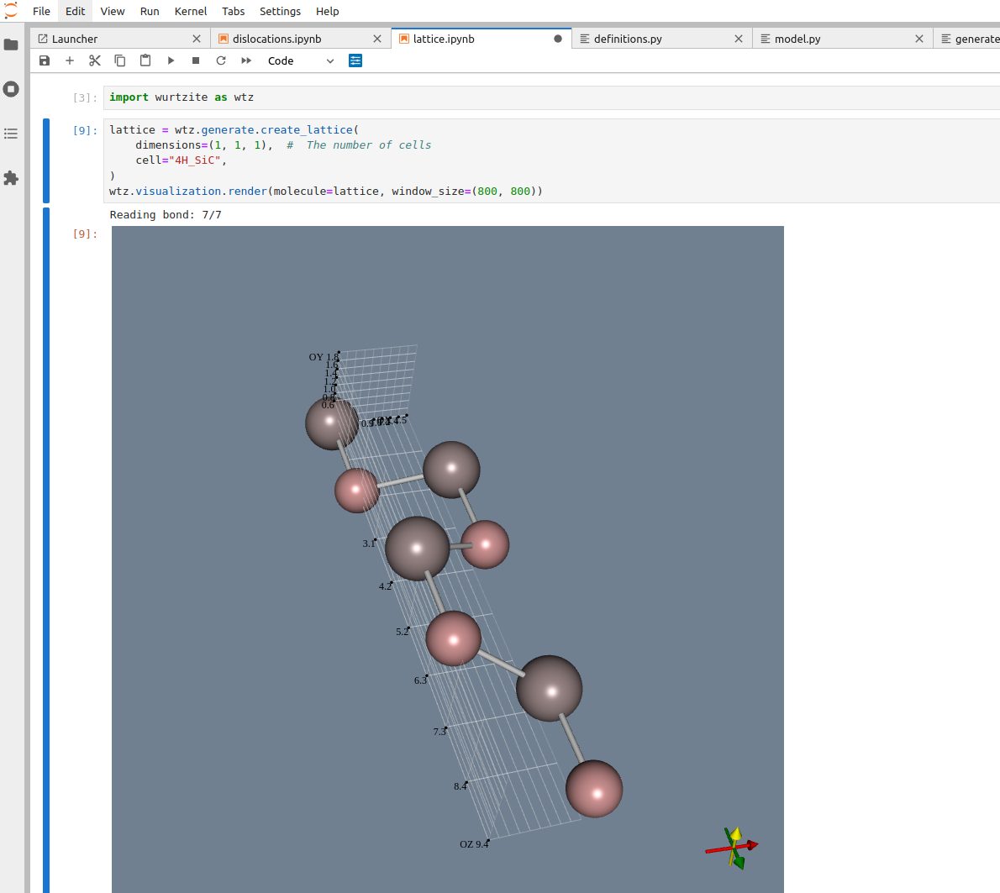
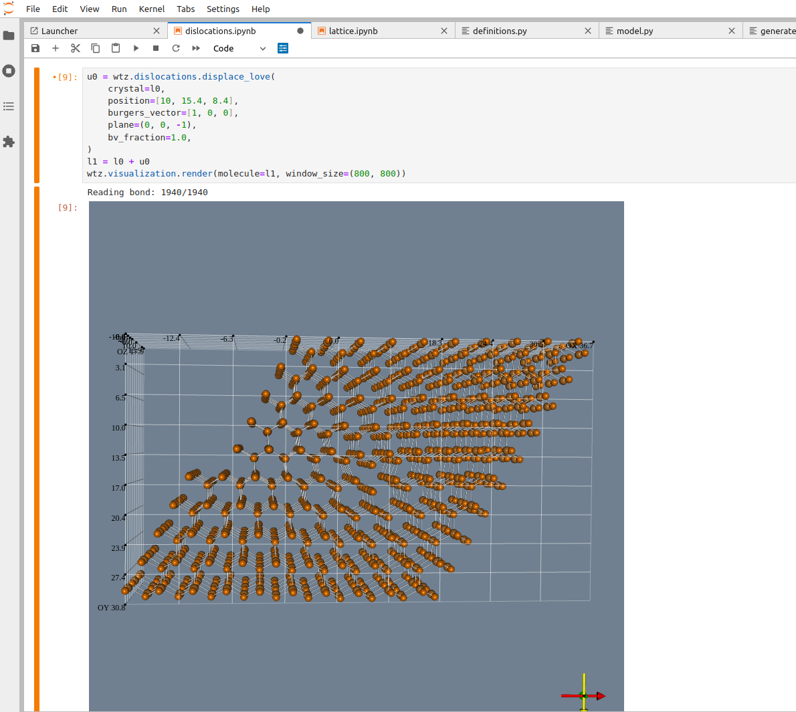

# crystalpy
Python package with software for crystallography. 

The package contains functions for:
- crystal structure definition and generation,
- crystal visualization,
- simulation of the crystal defect (dislocations),
- and many more...

## Installation

Anaconda3/Minconda3 is recommended.

Before using crystalpy please install [openbabel](https://openbabel.org/docs/current/UseTheLibrary/Python.html) Python package.

We recommend installing openbabel with Anaconda3/Miniconda3:

1. Install openbabel in the selected environment: `conda install -c conda-forge openbabel=3.1.1`.
2. Install swig: `conda install swig=4.0.2`.
3. Install openbabel Python package: `pip install --global-option="build_ext" --global-option="-I${CONDA_PREFIX}/include/openbabel3" --global-option="-L/${CONDA_PREFIX}/lib/" openbabel`.


Finally, install the crystalpy package with the following command:
```
pip install git+https://github.com/pjarosik/wurtzite.git
```

## Examples

Visit the `examples` directory to see how to:

1. Visualize crystal structure in the Jupyter Notebook:



2. How to perform simulate placement of dislocation core:

